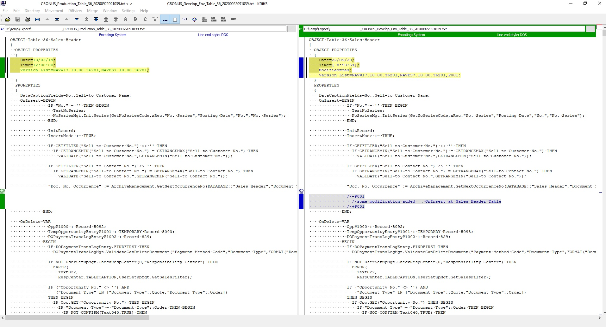

# Navision C/AL Simple Object Comparer

## Funcionamiento ##

Script para MSSQL Server que permite comparar los atributos de nombre, versión y fecha de objetos C/AL entre dos bases de datos **Navision 2013 R2**

Por ejemplo, permite comparar entornos de producción y desarrollo de una forma facil y rapida, mostrando un listado de objetos nuevos o modificados en cualquiera de los dos entornos.

El script devuelve tres conjutos de resultados.

Por orden de aparición

1. Objetos nuevos en cualquiera de los dos entornos. Indicando en que entorno está añadido
1. Objetos que tienen alguna diferencia en los atributos de:
	1. Fecha y hora de grabación del objeto
	1. Versionlist del objeto
	1. Nombre del objeto
1. Comandos de comparación y backup para los objetos con diferencias.	

Para relacionar los objetos entre entornos, se usa el tipo del objeto, el company id y su id numérico

Una vez señalados todos los objetos con diferencias, genera los comandos de la consola de sistema o powershell para:

1. Efectuar la comparativa de código fuente, usando el programa Kdiff3 http://kdiff3.sourceforge.net/
Columna de resultado: Comparison_Commands
1. Guardar un backup del objeto del servidor 1 en FOB y TXT.
Columna de resultado: Backup_SVR_1_Commands
1. Guardar un backup del objeto del servidor 2 en FOB y TXT.
Columna de resultado: Backup_SVR_2_Commands

Para hacer la comparativa de código fuente, selecciona la columna de Comparison_Commands para el objeto y objetos deseados, (cada objeto tiene ocho filas de comandos), despues copia Ctrl+C y pega en una ventana de símbolo de sistema. 

Al pegarlo en la consola, se ejecuta el proceso de exportar en txt cada uno de los objetos de ambos sistemas, y abrir el Kdiff3 para comparar el código fuente

Para hacer el backup de uno de los dos sistemas, es el mismo proceso, copia los comandos y pegalos en una consola de sistema. El exportador de navision, creará los objetos en fob y txt en la ruta configurada en el script.

**En caso de no funcionar el copiar y pegar en la consola, puedes pegarlo en un fichero de texto y guardarlo como .bat. Despues ejecuta el bat**

**Si copias todas las filas del resultado, abrirá un Kdiff por cada objeto a comparar. Así puedes comparar todos los objetos, o los referidos a un proyecto de una sola vez, pero ten en cuenta que le costará un tiempo hacerlo y consumirá muchos recursos de tu máquina.**

## Requisitos ##

Para exportar algunos objetos de navision en formato txt, puede ser necesario tener un permiso especial en tu licencia Navision

Kdiff3 instalado y con la ruta del ejecutable en la variable path del sistema windows

Tener instalado el programa Microsoft Dynamics NAV 2013 R2 Development Environmenty con la ruta del ejecutable en la variable path del sistema windows.

## Setup del script ##

Abrir el script con un cliente de bases de datos sql server. Tipo Microsoft SQL Server Management Studio

Buscar en el script la sección de Setup

Rellenar con los datos de los servidores a comparar

Ejecutar con F5

## Variable de sistema ##

Para poder ejecutar los comandos en la consola de sistema o powershell, es necesario añadir la ruta del ejecutable de Navision (finsql.exe) a la variable PATH del sistema. De igual manera, es necesario añadir la ruta del programa Kdiff3 a la variable PATH.

Añadir las rutas a finsql.exe y kdiff3.exe

